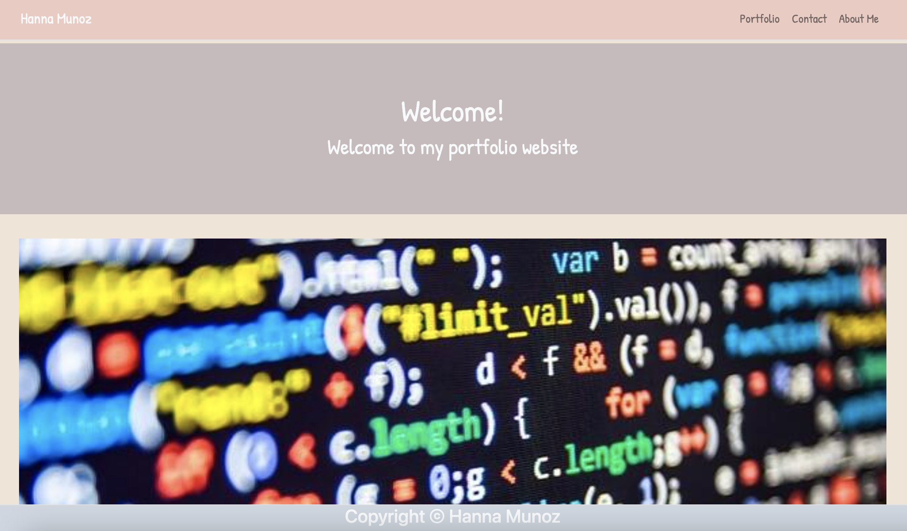

(../images/screen2.png)(../images/screen3.png)(../images/screen4.png)

# Portfolio:

Making a responsive portfolio page that works between large and small screens.

While using Bootstrap, the portfolio has a working Navbar, a responsive layout and responsive images.

All links between pages are functioning and the portfolio is personalized with my name and information.

# Technologies:
- HTML
- CSS
- Bootstrap
- Google Fonts

## Deployed Application Link

[https://hannamunoz.github.io/responsive.portfolio/](https://hannamunoz.github.io/responsive.portfolio/)